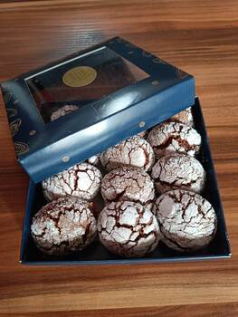

# Crinkles

## Ingredients

- 225g dark chocolate
- 60g butter
- 50g brown sugar
- 2x eggs
- 225g flour
- baking powder
- vanilla extract
- powder/crystal sugar (coating)

## Instructions

- melt chocolate with butter in water bath
- whisk eggs with brown sugar
- add chocolate (at room temperature)
- add flour (sift through a sieve), vanilla extract, baking powder
- fridge (3h) or freezer (0.5h)
- form balls (using ice cream scoop and hands)
- ball => crystal sugar => powder sugar
- 20min 170 degrees
