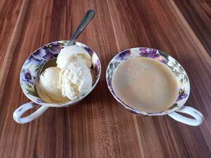

# White chocolate

## Ingredients
- 100ml milk
- 100ml + 200ml of heavy cream
- 3 egg yolks
- 100g white chocolate
- 50g sugar
- half vanilla 

## Instructions
- Vanilla inside 100ml milk + 100ml cream => boil
- Chop chocolate on side
- Mix sugar + egg yolks, pour in hot milk/cream slowly
- Put on stove to reach 84 degrees
- Pour on chocolate, leave to melt => put to fridge
- Whisk 200ml cream => fold it inside the bowl in fridge
- Ice cream machine

# Coffee

## Ingredients
- 235ml milk
- 235ml heavy cream
- 75g coffee beans
- 50g sugar
- 3 egg yolks
- 2g salt

## Instructions
- 235ml milk + 117.5ml cream + 50g sugar + 2g salt + 75g coffee
- almost boil, let rest with lid for 45 minutes
- prepare 117.5ml cream in ice bath
- reheat mixture to almost boil and slowly add some to 3 yolks, then back inside pot
- stir until little bit thicc
- sift out coffee inside cream in bath
- Icea cream machine
