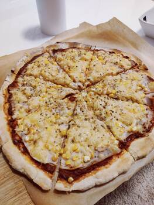

# Poolish
- 100ml water
- 2g dry yeast
- 1-2g honey
- 100g flour

# wait: 1h out, 16-24h fridge

# Pizza
- ingredients
    - 10ml water
    - 5g salt
    - 60g flour
    - Poolish
- water => salt => poolish => add flour

# wait: 15 minutes

# ball
- oil in hands, spatula

# wait: 1-2h
